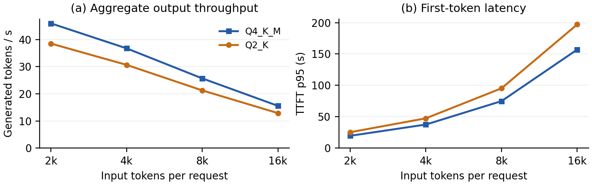
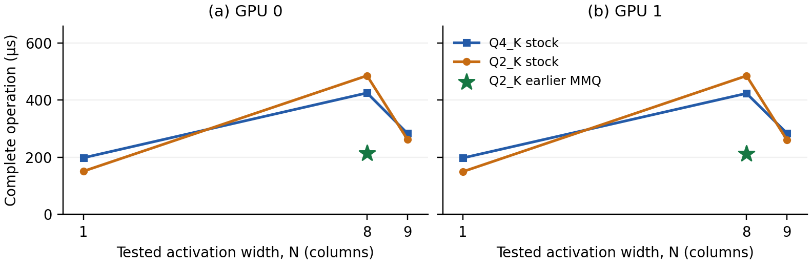

# Runtime Cost and Bottlenecks of Quantized Llama 70B Serving

*A short empirical study on two NVIDIA RTX A6000 GPUs · September 2026*

## Abstract

We characterize Llama-3.3-70B-Instruct serving through request measurements, GPU timelines, hardware counters, and isolated dispatch controls. At eight clients with 2,048 input and 512 output tokens, Q2_K delivers 16.2% lower throughput than Q4_K_M despite lower device-memory usage. Matched prefill and decode kernels read fewer DRAM bytes but execute 69.6% and 35.2% more instructions. A dispatch-only intervention reduces an isolated eight-column Q2 operation's duration by approximately 56%. These results identify instruction work and kernel selection as concrete costs of aggressive quantization in this configuration.

## 1. Introduction

Prior work characterizes quantization on Apple Silicon [1] and MI300X [2,3], linking runtime costs to hardware behavior. We ask: **when a smaller 70B model serves requests more slowly, which measured kernel costs explain the difference?** Our CUDA case study connects concurrent HTTP throughput to matched instruction counters and a dispatch intervention. The results concern two workstation GPUs, without establishing performance on MI300X or production cloud traffic.

## 2. Experimental Setup

We use two nominal 48-GB RTX A6000 GPUs and the CUDA backend of llama.cpp, pinned to commit `3f5e94d7c2ab2267fe39852051777fe30c1f49ef` [4]. Layer splitting assigns 41/39 transformer layers to GPU0/GPU1. Transformer weights and FP16 KV buffers reside on the GPUs, with flash attention enabled, automatic clocks, default 300-W power limits, and a 2-GiB reserve per GPU. Format names denote mixed tensor recipes: Q2_K uses Q2_K gate/up and Q3_K down projections; Q4_K_M includes Q4_K and Q6_K tensors.

1. **Serving and capacity.** We use the 14 completed 70B settings: nine Q4_K_M and five Q2_K measurements. Matched comparisons cover 2k/4k/8k/16k inputs at eight clients and 2k at 16 clients, where k = 1,024. Each setting has one closed-loop run with two requests per client, exactly 512 generated tokens, matched inputs, and prompt reuse disabled. Q4 capacity checks also cover 32/64 clients. We keep the earlier 128-output study separate.
2. **Kernel characterization.** Two fresh Nsight Systems timelines identify prefill/decode operations. Eight primary Nsight Compute captures cover two formats × two phases × two GPUs at eight clients and 2k input. Each comparison pools three gate and two up launches with identical geometry and explicit phase labels. Counters cover instructions, IPC, DRAM traffic, caches, occupancy, registers, stalls, and tensor activity [5]. Annotated profiling disables CUDA graphs and runs separately, without competing GPU workloads.
3. **Dispatch controls.** Forty-four isolated cases cover gate/up and down tensor types at widths 1/8/9/512 and width-8 Q2/Q3 dispatch interventions on both GPUs. Each case has one timing run with 20 internal synchronized operations and one counter capture of five operations. Deterministic synthetic weights and reference checks isolate implementation costs. Replay uses cache/clock control `none`; counter timings are diagnostic.

## 3. Runtime Cost

Throughput is generated tokens divided by HTTP burst duration, including drain. Time to first token (TTFT) includes scheduling and prompt processing. Time per output token (TPOT) is (stream duration − TTFT)/(output tokens − 1) per request. We report time and device memory, without estimating dollar cost.

*Table 1. Unprofiled serving at eight clients, 2,048 input tokens and 512 outputs. Device-memory peaks are sampled separately for each GPU.*

| Format | Output tok/s ↑ | TTFT p95 (s) ↓ | TPOT p95 (ms) ↓ | Peak VRAM, GPU0 / GPU1 (GiB) |
|---|---:|---:|---:|---:|
| Q4_K_M | 45.92 | 19.58 | 168.48 | 23.74 / 23.44 |
| Q2_K | 38.48 | 25.30 | 200.84 | 16.18 / 16.19 |

**Finding 1: memory savings coexist with a persistent throughput deficit.** Q2 saves 7.56/7.25 GiB at the respective device peaks, but throughput is 16.2% lower and TTFT/TPOT p95 are 29.2%/19.2% higher. Across 2k–16k input at eight clients, its throughput deficit remains 16.2–17.2% (Figure 1). At 16 clients and 2k input, the deficit narrows to 7.2%: 77.56 versus 83.54 tok/s. The latter setting lacks matched counters, so we do not assign its narrower gap to a particular kernel mechanism.

*Figure 1. Eight-client serving across power-of-two input lengths, with 512 outputs per request. Each point is one measured run; no run-to-run error bars are available. GPU0 recorded software thermal limiting throughout these settings; GPU1 also recorded it for Q2 at 8k/16k.*

**Finding 2: equal total prompt tokens need not imply equal KV capacity.** Q4's largest validated inputs are 16k, 8k and 4k at 8, 16 and 32 clients. Although these configurations and 64 × 2k each contain 131,072 prompt tokens, reserved KV grows with client count. The allocation is

**KV bytes = clients × (input tokens + 768) × 320 KiB.**

The extra 768 positions cover outputs, guard space and padding. The resulting KV totals are 41.875, 43.75, 47.5 and 55 GiB. The first three are verified allocations; 64 × 2k is a predicted exclusion: weights, KV and reserves require at least 98.04 GiB against 94.77 GiB available, before working buffers. The 41/39 layer split also requires per-device checks. All accepted measurements had zero sampled server swap. Q2's maximum context remains unresolved because its sweep is incomplete.

## 4. Runtime Bottlenecks

**Finding 3: Q2's extra instruction work outweighs its lower DRAM traffic.** Table 2 compares real-model feed-forward projections with M = 28,672 and K = 8,192. Prefill uses N = 512, a processing chunk within a 2k input; decode uses N = 8. N counts token vectors in a matrix operation and is distinct from context length.

*Table 2. Median profiled kernel durations and Q2 changes relative to Q4, from five matched-geometry launches per format/device/phase. These durations are not HTTP latency.*

| Phase | GPU | Q4 → Q2 duration (µs) | Instructions | DRAM reads | Duration |
|---|---:|---:|---:|---:|---:|
| Prefill | 0 | 2,264.00 → 3,363.10 | +69.6% | −30.0% | +48.5% |
| Prefill | 1 | 2,246.02 → 3,323.23 | +69.6% | −30.1% | +48.0% |
| Decode | 0 | 318.24 → 402.30 | +35.2% | −41.6% | +26.4% |
| Decode | 1 | 316.77 → 398.53 | +35.2% | −41.6% | +25.8% |

The pinned Q2 implementation uses 16-weight scale/offset groups versus Q4's 32-weight groups, requiring smaller partial products and additional corrections [4]. Prefill executes 1.875× as many floating-point multiply-add instructions and 2.25× as many integer-to-float conversions; decode ratios are 1.8× and 2×. Both formats handle quantization inside their multiplication kernels. Thus substantial overhead comes from scaling/conversion/correction, beyond simply extracting packed bits.

Higher IPC does not rescue Q2: active-cycle IPC increases from 2.14 to 2.37 in prefill while instruction count rises 69.6%. Active-cycle tensor-pipeline activity falls from approximately 36.7% to 27.0%. Decode uses 151 versus 125 registers per thread, reducing the register-limited resident-block count from eight to six and occupancy from approximately 32% to 24%. Neither format records local-memory spills. Q2's lower decode L2 hit rate is insufficient evidence of a memory bottleneck: its L1 hit rate is higher, DRAM traffic is lower, and GPU0 long-scoreboard stalls fall from 0.75 to 0.07 cycles per issued instruction. Register pressure is observed; its independent latency contribution is not isolated.

**Finding 4: the eight-column dispatch threshold imposes an avoidable cost.** Stock A6000 dispatch selects quantized matrix-vector multiplication (MMVQ) through N = 8 and matrix-matrix multiplication (MMQ) at N = 9 for these types. Q2 wins the isolated comparison at N = 1, loses at N = 8, and wins again at N = 9 (Figure 2). Changing only Q2/Q3's N = 8 dispatch to MMQ cuts Q2 gate/up operation duration by 55.9–56.3% on the two GPUs: a 2.27–2.29× speedup. Total-path instructions decrease 78.3%, while DRAM reads increase approximately 1.1%. Q3 down projections improve by 44.6–45.1%.

*Figure 2. Unprofiled complete-operation medians, including host dispatch/synchronization and auxiliary kernels, for isolated gate/up matrices. Lines connect tested widths only. Stars change the N = 8 dispatch to MMQ. Q4_K denotes the tensor type; N = 1 is an unfused reference, not a reproduction of fused single-client serving.*

The faster Q2 MMQ kernel has lower occupancy than stock MMVQ, strengthening the explanation based on instruction work and dispatch rather than occupancy alone. The intervention changes only diagnostic binaries. Its speedup has not been measured in whole-model serving, and the selected kernels do not establish a whole-workload roofline classification.

## 5. Limitations and Conclusion

These are single-run, closed-loop observations under automatic clocks. Thermal exposure limits comparisons, and profiler replay cannot replace ordinary serving timing. Accuracy, realistic arrivals and whole-model dispatch tuning were not evaluated. Full endpoint profiling and the remaining 70B sweep are incomplete; this paper does not compare pending IQ1_M/Q8_0 results or capacity-excluded FP16.

Model compression lowers resident memory while increasing the instruction work of important kernels. A dispatch change removes much of the isolated eight-column penalty. Quantization choice therefore needs both request-level cost measurements and an operation-level explanation; nominal weight precision alone is insufficient.

## References

[1] A. Benazir and F. X. Lin. *Profiling Large Language Model Inference on Apple Silicon: A Quantization Perspective*. Author preprint, 2025. [arXiv:2508.08531v1](https://arxiv.org/abs/2508.08531v1).

[2] A. Benazir and F. X. Lin. *Understanding Large Language Model Inference on Cloud: Datacenter GPUs: A Quantization Perspective*. Supplied project paper. [Tapia.pdf](../references/Tapia.pdf).

[3] A. Benazir. *Profiling Quantized LLMs on AMD MI300x with ROCm: What the Hardware Is Really Telling Us*; *What ROCm Profiling Revealed About Quantized LLMs on AMD's Fastest GPU*. January 2026. [January 3 article](https://medium.com/@afsara.benazir/profiling-quantized-llms-on-amd-mi300x-with-rocm-what-the-hardware-is-really-telling-us-ac3cc33ebcff), [January 10 article](https://medium.com/@afsara.benazir/what-rocm-profiling-revealed-about-quantized-llms-on-amds-fastest-gpu-c0edfab9624f).

[4] ggml-org. *llama.cpp*, pinned source: [quantization layouts](https://github.com/ggml-org/llama.cpp/blob/3f5e94d7c2ab2267fe39852051777fe30c1f49ef/ggml/src/ggml-common.h#L293), [matrix implementation](https://github.com/ggml-org/llama.cpp/blob/3f5e94d7c2ab2267fe39852051777fe30c1f49ef/ggml/src/ggml-cuda/mmq-vec-dot.cuh#L751), [dispatch](https://github.com/ggml-org/llama.cpp/blob/3f5e94d7c2ab2267fe39852051777fe30c1f49ef/ggml/src/ggml-cuda/mmvq.cu#L318).

[5] NVIDIA. *Nsight Compute Profiling Guide*. [Metrics and replay methodology](https://docs.nvidia.com/nsight-compute/ProfilingGuide/).

**Artifacts.** [Serving measurements](../results/cuda-context-study/report/runtime.csv), [capacity records](../results/cuda-context-study/report/capacity.csv), and [counter/control report with raw links](../results/cuda-context-study/diagnostics/q2-q4-priority/README.md). Figures are regenerated from these data; build instructions accompany this paper.
