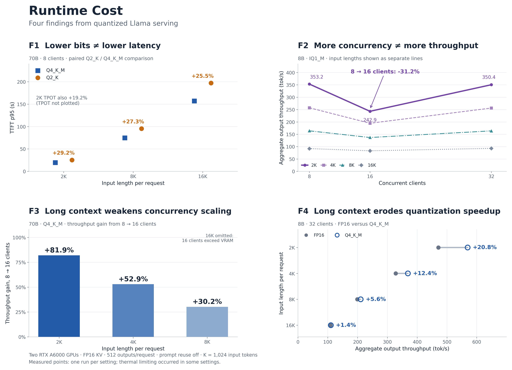

# Runtime Cost poster figures

**Alternate two-line version:** [PDF](runtime-cost-two-line.pdf) · [PNG](runtime-cost-two-line.png) · [editable SVG](runtime-cost-two-line.svg). Both panels show all five formats on 8B: throughput normalized to FP16 at **32 clients**, and throughput change from **8 to 16 clients**, over 2K/4K/8K/16K inputs. The 70B latency annotation is explicitly labeled as a separate 2K/eight-client measurement. The recovery annotation reports 8B IQ1_M at 2K. [Derived values and provenance](two-line-data.json).

The normalized plot shows Q4/Q8's positive advantages shrinking and Q2 falling below FP16. IQ1_M remains below FP16, while its deficit narrows. In the concurrency plot, four formats have positive, declining gains; IQ1_M stays negative, with a smaller penalty at longer inputs. These findings do not imply every format has the same slope.

[Combined poster: PDF](runtime-cost-poster.pdf) · [PNG](runtime-cost-poster.png) · [editable SVG](runtime-cost-poster.svg)



Each figure uses a different visual form. All main-poster points are measurements from the saved study; no new experiments were run. Every setting uses two RTX A6000 GPUs, FP16 KV, 512 generated tokens per request and no prompt reuse. K denotes 1,024 input tokens, not total input-plus-output context.

| Finding | Visual | Model and setting | Individual exports |
|---|---|---|---|
| F1. Lower bits ≠ lower latency | Paired scatter groups at 2K/8K/16K | 70B, C8; Q2_K versus Q4_K_M; TTFT p95 | [PDF](figures/f1-precision-latency.pdf), [PNG](figures/f1-precision-latency.png), [SVG](figures/f1-precision-latency.svg) |
| F2. More concurrency ≠ more throughput | Concurrency–throughput lines, 2K emphasized | 8B IQ1_M; C8/C16/C32; 2K/4K/8K/16K | [PDF](figures/f2-concurrency-throughput.pdf), [PNG](figures/f2-concurrency-throughput.png), [SVG](figures/f2-concurrency-throughput.svg) |
| F3. Long context weakens concurrency scaling | Bars of percentage throughput gain | 70B Q4_K_M; C8 → C16; 2K/4K/8K | [PDF](figures/f3-concurrency-gain.pdf), [PNG](figures/f3-concurrency-gain.png), [SVG](figures/f3-concurrency-gain.svg) |
| F4. Long context erodes quantization speedup | Horizontal dumbbells | 8B, C32; FP16 versus Q4_K_M; 2K/4K/8K/16K | [PDF](figures/f4-quantization-gap.pdf), [PNG](figures/f4-quantization-gap.png), [SVG](figures/f4-quantization-gap.svg) |

F1 uses paired format groups because the 70B files contain mixed tensor recipes; nominal labels should not be plotted as exact 2.0/4.0 bits per weight. The plotted metric is TTFT p95. The extra 2K TPOT annotation comes from the same serving runs and is explicitly marked as not plotted.

F3's 16K point is omitted because 70B Q4_K_M at C16/P16K was capacity-excluded. A missing or excluded setting is not a zero-throughput measurement. F4 uses 8B because 70B FP16 was excluded before download/load. Percentage labels are Q4's throughput advantage relative to FP16; the 1.4% long-context gap does not establish a statistically significant winner.

These are single-run observations. Thermal limiting occurred in several settings, including the 70B measurements and longer 8B contexts; the three 8B IQ1_M 2K runs did not record thermal-limit flags. The figures characterize serving behavior without assigning unmeasured hardware causes. The separate [Runtime Bottlenecks report](../../results/cuda-context-study/diagnostics/q2-q4-priority/README.md) contains the measured kernel evidence.

## Optional 64K illustration

[Illustration: PDF](illustrative/f1-with-64k-extrapolation.pdf) · [PNG](illustrative/f1-with-64k-extrapolation.png) · [SVG](illustrative/f1-with-64k-extrapolation.svg) · [Calculation and source values](illustrative/estimates.json)

This separate F1 variant adds hollow, explicitly labeled 64K points and uses a labeled logarithmic latency axis. The measured poster above contains no synthetic points. The requested illustrative calculation is:

`70B 64K TTFT p95 = 70B 16K TTFT p95 × (8B 64K TTFT p95 / 8B 16K TTFT p95)`

The calculation is performed independently for Q4_K_M and Q2_K at eight clients. It gives approximately **1,100 seconds for Q4** and **1,280 seconds for Q2**. These are illustrative values, not measurements or validated predictions. They must not be used to support a measured finding.

The configuration cannot run fully resident here: C8/P64K needs **161.875 GiB of FP16 KV alone**, before model weights. Moreover, the donor 8B 16K run contains 16 requests, while its 64K capacity-extension run contains eight. Cross-model scaling and different burst sizes prevent interpreting these numbers as a controlled projection. These limitations are printed on the illustration itself.

## Rebuild

From the repository root, using Python with matplotlib:

```sh
python3 paper/poster/build.py
# Alternate two-line version; preserves the original four-panel outputs:
python3 paper/poster/build.py --layout two-line
# Also generate the separate requested synthetic illustration:
python3 paper/poster/build.py --include-illustration
```

On this workspace, use `/home/hys4qm/anaconda3/bin/python3`. [data.json](data.json) records the measured inputs, formulas and source hashes. All canonical result files are read-only inputs. Only this poster directory is written.
