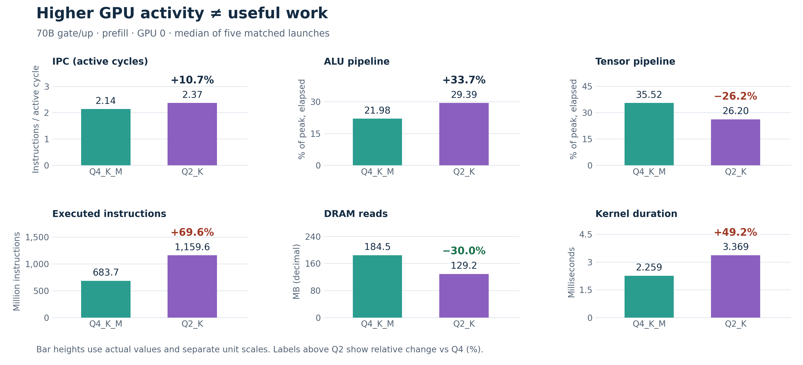
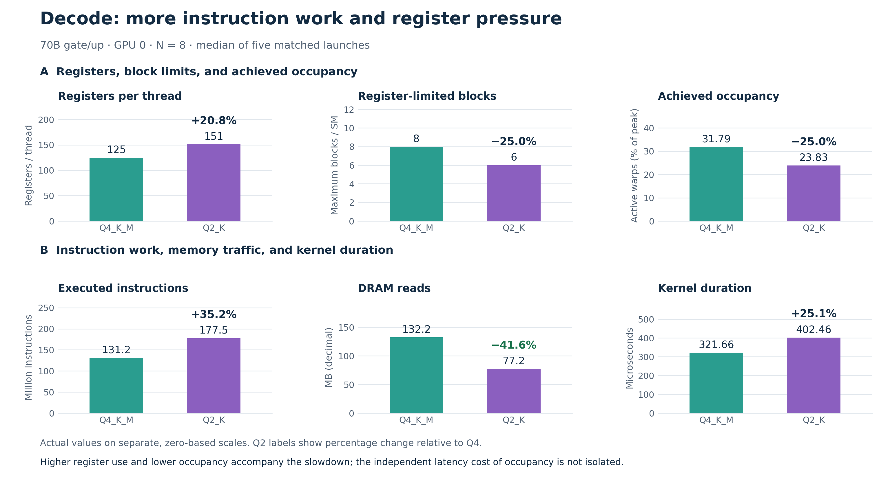
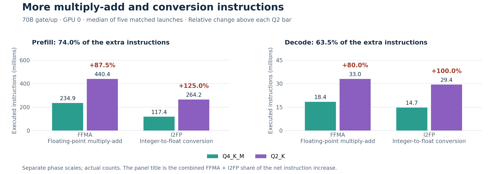
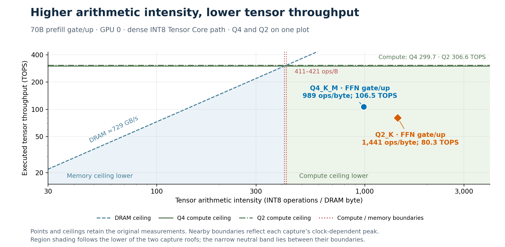
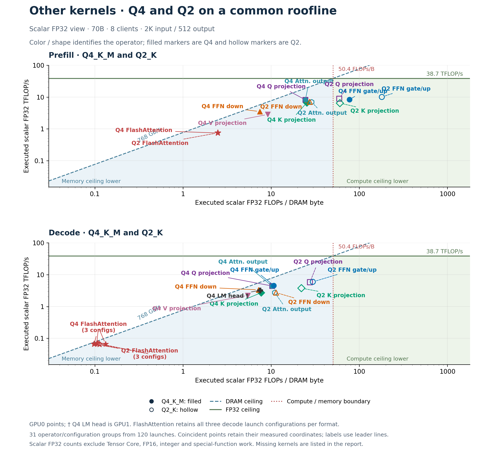

# Runtime bottlenecks of Q2 and Q4 quantization

*Llama 70B · two RTX A6000 GPUs · eight clients · 2,048 input / 512 output tokens*

**Quantization-related arithmetic and conversion overhead limits Q2's runtime benefit.** GPU0 prefill gate/up reads 30.0% fewer DRAM bytes yet executes 69.6% more instructions and takes 49.2% longer. Decode follows the same pattern (Table 2). Opcode counts and kernel code connect the extra instructions to finer quantization groups and scale/offset processing.

Gate/up comparisons use five-launch medians from the full-section captures. GPU0 is shown unless labeled otherwise; Table 6 checks both GPUs. Q4_K_M and Q2_K are model recipes; the selected gate/up tensors use Q4_K and Q2_K respectively.

*Table 1. Prefill gate/up, GPU0; M = 28,672, N = 512, K = 8,192.*

| Metric | Q4_K_M | Q2_K | Q2 change vs Q4 |
| --- | ---: | ---: | ---: |
| Kernel duration (ms) | 2.259 | 3.369 | +49.2% |
| Executed instructions (M) | 683.698 | 1,159.625 | +69.6% |
| DRAM reads (MB) | 184.509 | 129.168 | −30.0% |
| Tensor pipeline (% peak, elapsed) | 35.52 | 26.20 | −26.2% (−9.32 pp) |
| ALU pipeline (% peak, elapsed) | 21.98 | 29.39 | +33.7% (+7.41 pp) |
| IPC (active cycles) | 2.14 | 2.37 | +10.7% |

*Figure 1. Top: IPC, ALU and Tensor pipeline activity. Bottom: instructions, DRAM reads and duration. Bars use actual values on separate, zero-based axes; Q2 labels show relative percentage changes from Q4.*

**Prefill analysis.** IPC rises 10.7% and ALU activity rises 33.7% (+7.41 percentage points), while Tensor activity falls 26.2% (−9.32 points). Higher activity accompanies 69.6% more instructions and longer execution. Table 4 attributes 74.0% of extra instructions to multiply-add and integer-to-float conversion, supporting arithmetic/conversion overhead. The measurements do not isolate each category's runtime cost; pipeline percentages describe separate resources and must not be summed as a partition of runtime.

<!-- PAGEBREAK -->

**Decode also spends more time despite lower DRAM demand.** Q2's kernel duration rises from 321.664 to 402.464 µs. Its 41.6% reduction in DRAM reads therefore coexists with a 25.1% execution-time increase.

*Table 2. Decode gate/up, GPU0; M = 28,672, N = 8, K = 8,192.*

| Metric | Q4_K_M | Q2_K | Q2 change vs Q4 |
| --- | ---: | ---: | ---: |
| Kernel duration (µs) | 321.664 | 402.464 | +25.1% |
| Executed instructions (M) | 131.246 | 177.494 | +35.2% |
| DRAM reads (MB) | 132.231 | 77.173 | −41.6% |
| Achieved occupancy (%) | 31.79 | 23.83 | −25.0% (−7.96 pp) |
| Registers per thread | 125 | 151 | +20.8% |
| Register-limited blocks per SM | 8 | 6 | −25.0% |
| Tensor pipeline (% peak, elapsed) | 0.00 | 0.00 | 0.00 pp; relative change undefined |

*Figure 2. Top row: registers per thread, the register-limited maximum blocks per SM, and achieved occupancy. Bottom row: instructions, DRAM reads and duration. Actual values and relative changes are shown on separate axes. The arrangement compares observations without assigning the slowdown to occupancy alone.*

**Decode analysis.** Figure 2A shows register use increasing from 125 to 151 per thread (+20.8%), the register-limited block count falling from eight to six (−25.0%), and achieved occupancy falling from 31.79% to 23.83% (−25.0%; −7.96 percentage points). Figure 2B shows 35.2% more instructions and 25.1% longer duration despite 41.6% fewer DRAM reads. Together, these document greater instruction work and register pressure. Occupancy's independent latency contribution is not isolated. Neither kernel records local-memory spill traffic in these captures.

**The same direction appears on GPU1.** Prefill takes 48.5% longer with 30.1% fewer DRAM reads; decode takes 25.9% longer with 41.6% fewer DRAM reads. Instruction-count increases are identical across the two GPUs. The absolute timings are retained in Table 6.

<!-- PAGEBREAK -->

**Why Q2 executes more instructions.** Q2_K uses smaller scale/offset groups, doubling the number of independently scaled groups per 256 weights. The [pinned format definitions](https://github.com/ggml-org/llama.cpp/blob/3f5e94d7c2ab2267fe39852051777fe30c1f49ef/ggml/src/ggml-common.h#L293) establish this layout difference.

*Table 3. Quantization groups in the selected gate/up weight tensors.*

| Layout property | Q4_K | Q2_K |
| --- | ---: | ---: |
| Weights per scale/offset group | 32 | 16 |
| Groups per 256 weights | 8 | 16 |

Each group represents weights as w = s × q + b; its dot product is s × Σ(q × x) + b × Σx. The [Q2 CUDA implementation](https://github.com/ggml-org/llama.cpp/blob/3f5e94d7c2ab2267fe39852051777fe30c1f49ef/ggml/src/ggml-cuda/mmq-vec-dot.cuh#L675) combines more separately scaled partial products and offset corrections than the [Q4 path](https://github.com/ggml-org/llama.cpp/blob/3f5e94d7c2ab2267fe39852051777fe30c1f49ef/ggml/src/ggml-cuda/mmq-vec-dot.cuh#L313). These operations are fused into quantized multiplication and require additional arithmetic and conversions. The measured opcode counts support this mechanism.

*Table 4. GPU0 instruction counts, in millions. FFMA = floating-point multiply-add; I2FP = integer-to-float conversion. Other opcodes include all remaining categories.*

| Phase / instruction | Q4 (M) | Q2 (M) | Extra (M) | Change |
| --- | ---: | ---: | ---: | ---: |
| Prefill / FFMA | 234.881 | 440.402 | +205.521 | +87.5% |
| Prefill / I2FP | 117.441 | 264.241 | +146.801 | +125.0% |
| Prefill / Other opcodes | 331.377 | 454.982 | +123.605 | +37.3% |
| Prefill / All instructions | 683.698 | 1,159.625 | +475.927 | +69.6% |
| Decode / FFMA | 18.350 | 33.030 | +14.680 | +80.0% |
| Decode / I2FP | 14.680 | 29.360 | +14.680 | +100.0% |
| Decode / Other opcodes | 98.216 | 115.104 | +16.888 | +17.2% |
| Decode / All instructions | 131.246 | 177.494 | +46.248 | +35.2% |

*Figure 3. Actual opcode counts; percentage changes above Q2 use Q4 as the reference. Each panel title reports the two categories' combined share of the net instruction increase.*

FFMA and I2FP contribute 352.322M of 475.927M extra prefill instructions (**74.0%**) and 29.360M of 46.248M extra decode instructions (**63.5%**). The same counts occur on GPU1. These are shares of additional instructions; the corresponding shares of runtime have not been isolated. The remaining categories reconcile exactly to the overall instruction counter.

<!-- PAGEBREAK -->

**The Tensor Core roofline provides supporting context.** In prefill, Q2 moves to higher arithmetic intensity but lower tensor throughput: approximately 989 → 1,441 INT8 operations per DRAM byte and 106.5 → 80.3 TOPS. Its lower DRAM demand does not become higher tensor arithmetic throughput. The opcode breakdown and kernel source provide the direct evidence for the added arithmetic/conversion work.

*Table 5. Prefill gate/up, GPU0; dense INT8 Tensor Core arithmetic path.*

| Metric | Q4_K_M | Q2_K | Q2 change vs Q4 |
| --- | ---: | ---: | ---: |
| Tensor arithmetic intensity (ops/byte) | 989.0 | 1,441.2 | +45.7% |
| Executed tensor throughput (TOPS) | 106.493 | 80.305 | −24.6% |
| Tensor compute (% of path peak) | 35.523 | 26.195 | −26.3% (−9.328 pp) |
| DRAM read + write bandwidth (GB/s) | 107.760 | 55.705 | −48.3% |
| DRAM throughput (% of DRAM peak) | 14.783 | 7.642 | −48.3% (−7.141 pp) |

*Figure 4. Q4 (blue circle) and Q2 (orange diamond) share one plot. Dashed blue DRAM ceilings, green compute ceilings and dotted red boundaries follow the reference figure's styling while retaining the original INT8 measurements. DRAM traffic includes reads and writes; TOPS measures executed tensor operations.*

**Roofline analysis.** Q2's arithmetic intensity increases by 45.7%, yet tensor throughput decreases by 24.6%. DRAM throughput falls from about 14.8% to 7.6% of peak, which does not support a simple saturated-DRAM-bandwidth explanation for this prefill comparison. The plotted points are on the compute-ceiling side of their tensor-path rooflines, but their distance below that ceiling does not identify a unique limiting resource. The instruction and pipeline counters provide the additional evidence for the interpretation.

The roofline covers the selected prefill kernel's dense INT8 Tensor Core work. Nominal Q2/Q4 storage precision is distinct from that arithmetic path. Scalar arithmetic, integer unpacking/correction, scheduling and other kernels are not fully described by this tensor view. The MMVQ decode kernels have zero measured tensor work, so this Tensor Core plot is not applied to decode or to the whole serving workload.

<!-- PAGEBREAK -->

**Other kernels share a scalar FP32 roofline.** Figure 5 overlays Q4 and Q2 within each phase, including all 31 available operator/configuration groups from 120 saved launches.

*Figure 5. Prefill above, decode below; Q4 filled, Q2 hollow. Colors/shapes identify operators. All points are GPU0 except Q4's decode LM head (†, GPU1). FlashAttention retains three decode configurations per format.*

Coordinates use predicated-on scalar FP32 work (FADD + FMUL + 2 × FFMA) per DRAM read/write byte and per second. Tensor Core, FP16, integer and special-function work are excluded. Higher executed FLOP/s can reflect extra arithmetic. These exploratory captures differ from the full-section reruns; FlashAttention includes fused softmax.

**Missing counters:** Q2 V projection and LM head; both prefill LM heads; activation quantization, RMSNorm/RoPE, SiLU, residual additions, KV-cache updates and other helpers. [Coordinates](operator-roofline-data.csv) retain kernel/configuration and sample counts; the [source method](../../results/cuda-context-study/diagnostics/q2-q4-full-sections/roofline-operators.md) documents validation and rated per-GPU ceilings.

<!-- PAGEBREAK -->

**Both GPUs corroborate the central finding.** The direction and magnitude of the changes are similar across devices, with approximately 49% longer prefill kernels and 25–26% longer decode kernels for Q2.

*Table 6. Five-launch medians from the same full-section dataset. All change columns compare Q2 against Q4.*

| Phase | GPU | Q4 time (µs) | Q2 time (µs) | Time change | Instructions | DRAM reads |
| --- | ---: | ---: | ---: | ---: | ---: | ---: |
| Prefill | 0 | 2,258.528 | 3,369.440 | +49.2% | +69.6% | −30.0% |
| Prefill | 1 | 2,245.792 | 3,335.456 | +48.5% | +69.6% | −30.1% |
| Decode | 0 | 321.664 | 402.464 | +25.1% | +35.2% | −41.6% |
| Decode | 1 | 317.920 | 400.256 | +25.9% | +35.2% | −41.6% |

**Measurement and reporting conventions.** The saved validation records confirm all eight expected captures: two formats × two phases × two GPUs. Each capture has eight warmup requests and eight profiled requests, and pools three gate plus two up launches with matched geometry and phase. Prefill width N = 512 is a processing chunk within the 2,048-token input; decode width N = 8 counts token vectors in the matrix operation. The server retains its 41/39-layer split and FP16 KV cache. CUDA graphs are disabled for annotations; clocks are automatic and cache control is none.

Percentage change = 100 × (Q2 value / Q4 value − 1). Calculations use unrounded source values, with display rounding applied afterward. For percentage-valued counters, pp denotes the absolute percentage-point difference. A positive duration change is a slowdown; a negative DRAM-read change is a traffic reduction. Relative change is undefined when both values are zero. MB and GB use decimal units; M instructions means one million instructions. Figures use separate scales because the metrics have different physical units.

**Scope of the finding.** These are kernel-level profiler replay measurements, not request latency or end-to-end throughput. The detailed gate/up comparison uses five launches from one capture per case; the broader operator roofline uses 1–5. Neither provides independent run-to-run uncertainty. GPU1 corroborates the gate/up pattern without establishing its universality across hardware or workloads. Opcode counts identify additional instruction categories, but their separate latency costs are not isolated. The other-kernel roofline describes only each kernel's scalar FP32 arithmetic.

**Report takeaway.** Q2_K's finer quantization groups increase partial-product processing, conversions and scale/offset corrections. FFMA and I2FP account for 74.0% of additional prefill instructions and 63.5% in decode. The selected kernels read fewer DRAM bytes but execute more instructions and run longer. The roofline supports the memory/compute interpretation; the instruction trace and kernel implementation identify the mechanism.

**Source data and reproducibility.** This report uses the existing [full-section capture report](../../results/cuda-context-study/diagnostics/q2-q4-full-sections/README.md), [hardware metric medians](../../results/cuda-context-study/diagnostics/q2-q4-full-sections/all-hardware-metrics.csv), [opcode instances](../../results/cuda-context-study/diagnostics/q2-q4-full-sections/instruction-instances.csv), [derived roofline values](../../results/cuda-context-study/diagnostics/q2-q4-full-sections/roofline-values.csv), [operator coordinates](../../results/cuda-context-study/diagnostics/q2-q4-full-sections/operator-roofline-points.csv) and their saved validation records. Format and kernel references use llama.cpp commit 3f5e94d7c2ab2267fe39852051777fe30c1f49ef. The source report links raw Nsight captures. No new inference or profiling was run.

The adjacent [report-data.json](report-data.json), [comparison-data.csv](comparison-data.csv), [opcode-comparison-data.csv](opcode-comparison-data.csv), [instruction-attribution-data.csv](instruction-attribution-data.csv) and [operator-roofline-data.csv](operator-roofline-data.csv) preserve figure/table inputs. [evidence.json](evidence.json) records source hashes. Rebuild with `python3 paper/runtime-bottlenecks-report/build.py` from the repository root; dependencies are Matplotlib, NumPy, Markdown and ReportLab, with existing document libraries discovered automatically.
