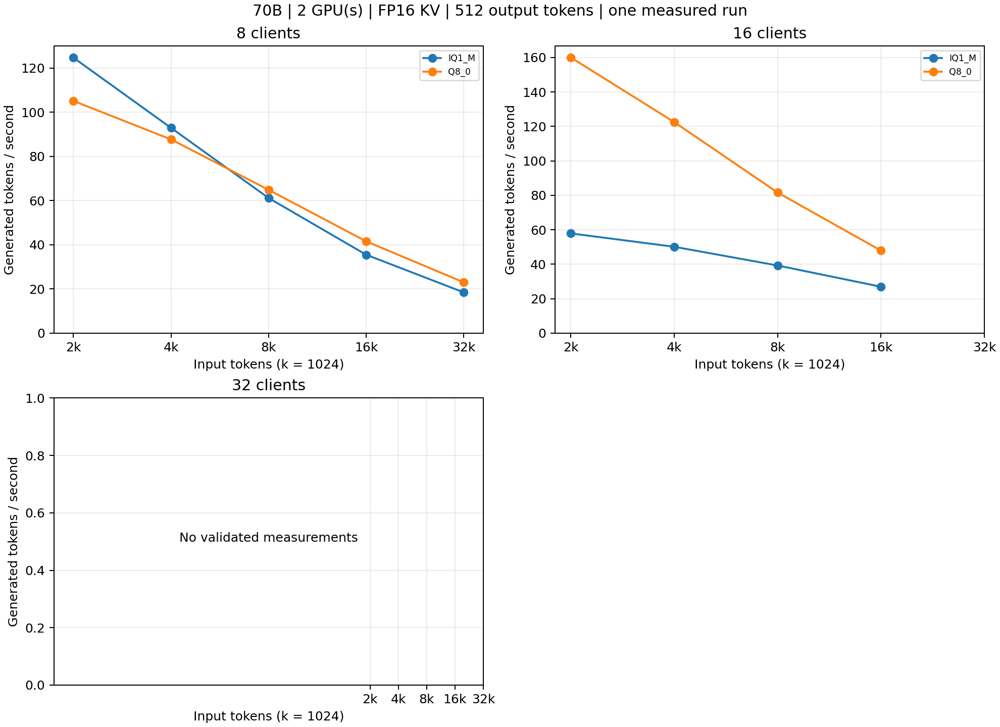
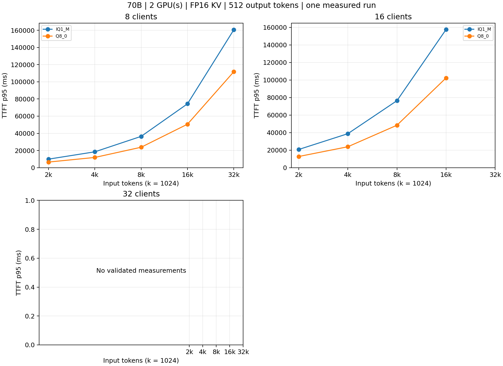
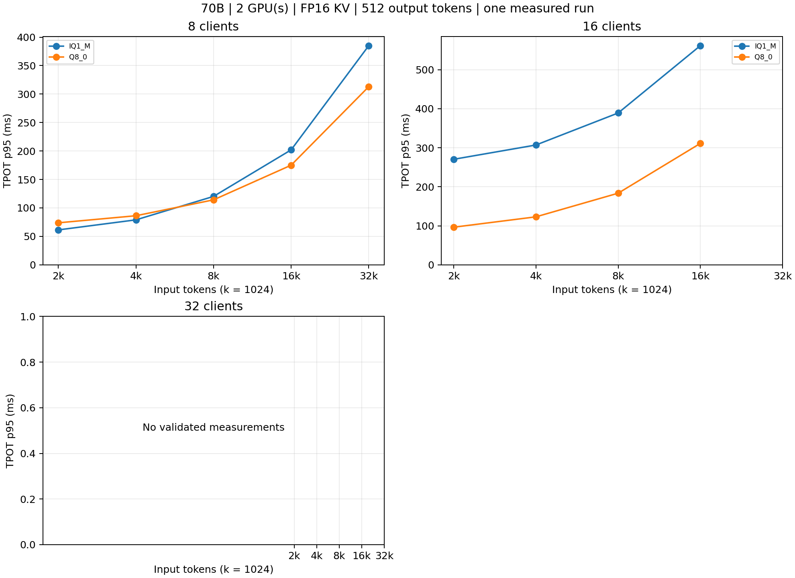
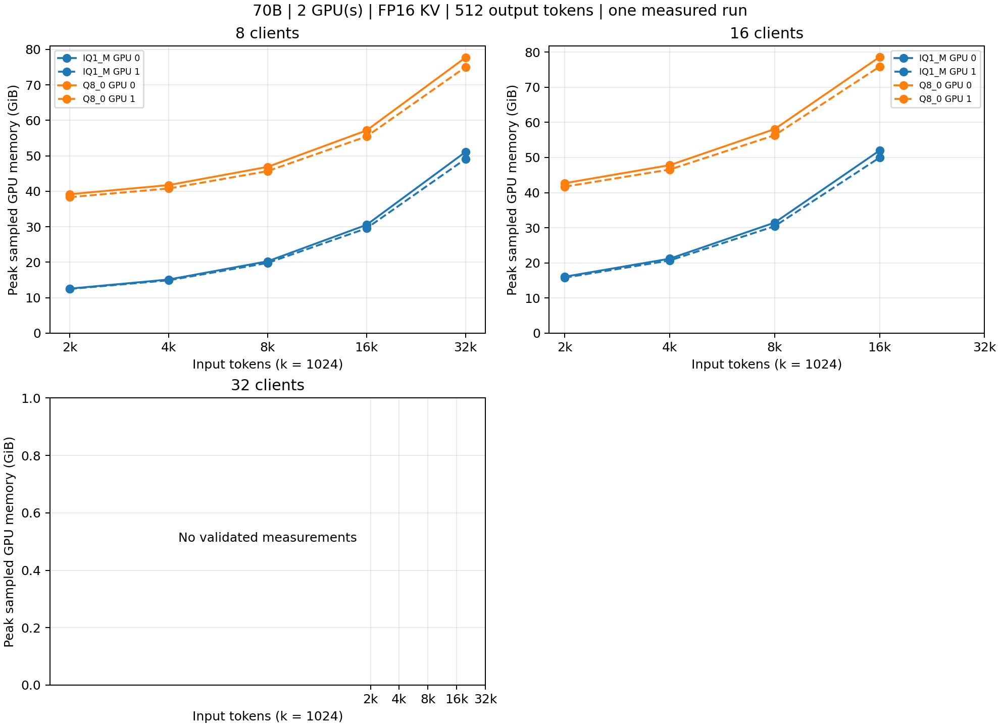

# RTX PRO 6000 Blackwell serving metrics

Status: **incomplete**. 18/30 settings measured; 2 capacity-excluded; 10 unresolved.

2 GPU(s), physical indices 0, 1. Model/format scope: {'70b': ['IQ1_M', 'Q8_0']}.

One measured run per setting: C discarded warmup requests and 2C measured requests, exactly 512 output tokens each. FP16 KV, prompt reuse off. Throughput is aggregate generated tokens divided by the measured HTTP window. TTFT/TPOT percentiles describe requests within that run; run-to-run variation is unmeasured. Memory is device-total SMI sampling within that same window, in GiB.

[Runtime CSV](runtime.csv) · [All cell statuses](capacity.csv) · [Completion audit](completion-audit.json)

| Model | Format | Clients | Input tokens | TTFT p50 ms | TTFT p95 ms | TPOT p50 ms | TPOT p95 ms | Generated tok/s | GPU 0 peak GiB | GPU 1 peak GiB |
| --- | --- | --- | --- | --- | --- | --- | --- | --- | --- | --- |
| 70b | IQ1_M | 8 | 2048 | 4003.77 | 9945.54 | 56.74 | 61.35 | 124.72 | 12.54 | 12.44 |
| 70b | IQ1_M | 8 | 4096 | 6423.60 | 18467.77 | 74.00 | 79.01 | 92.93 | 15.11 | 14.88 |
| 70b | IQ1_M | 8 | 8192 | 7667.60 | 36460.44 | 115.66 | 120.18 | 61.17 | 20.25 | 19.77 |
| 70b | IQ1_M | 8 | 16384 | 14693.69 | 74367.20 | 196.46 | 201.92 | 35.48 | 30.53 | 29.55 |
| 70b | IQ1_M | 8 | 32768 | 27862.40 | 160593.13 | 378.25 | 384.90 | 18.43 | 51.09 | 49.12 |
| 70b | IQ1_M | 16 | 2048 | 4511.21 | 20762.42 | 267.63 | 270.39 | 57.89 | 16.06 | 15.79 |
| 70b | IQ1_M | 16 | 4096 | 7346.90 | 38764.70 | 303.69 | 307.00 | 50.12 | 21.19 | 20.67 |
| 70b | IQ1_M | 16 | 8192 | 10406.12 | 76413.87 | 380.84 | 389.03 | 39.26 | 31.46 | 30.44 |
| 70b | IQ1_M | 16 | 16384 | 17197.36 | 157613.36 | 541.90 | 561.68 | 26.90 | 51.99 | 49.97 |
| 70b | Q8_0 | 8 | 2048 | 2532.97 | 6536.51 | 70.89 | 73.81 | 105.14 | 39.17 | 38.34 |
| 70b | Q8_0 | 8 | 4096 | 4100.83 | 11924.13 | 83.06 | 86.23 | 87.71 | 41.74 | 40.79 |
| 70b | Q8_0 | 8 | 8192 | 6008.08 | 23817.93 | 110.59 | 114.14 | 64.87 | 46.88 | 45.68 |
| 70b | Q8_0 | 8 | 16384 | 9285.97 | 50643.70 | 170.51 | 175.00 | 41.56 | 57.16 | 55.46 |
| 70b | Q8_0 | 8 | 32768 | 18868.66 | 111744.82 | 304.26 | 312.90 | 22.97 | 77.72 | 75.02 |
| 70b | Q8_0 | 16 | 2048 | 2572.44 | 12754.82 | 94.24 | 96.35 | 160.06 | 42.69 | 41.69 |
| 70b | Q8_0 | 16 | 4096 | 4419.42 | 23868.42 | 120.12 | 122.94 | 122.55 | 47.82 | 46.58 |
| 70b | Q8_0 | 16 | 8192 | 6285.65 | 48416.15 | 179.54 | 183.52 | 81.63 | 58.09 | 56.34 |
| 70b | Q8_0 | 16 | 16384 | 10699.91 | 102376.62 | 302.86 | 311.22 | 47.89 | 78.62 | 75.87 |

